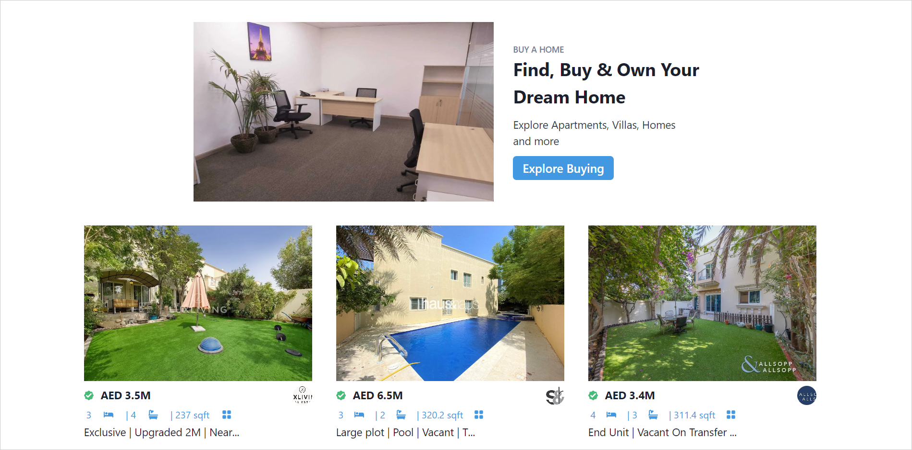
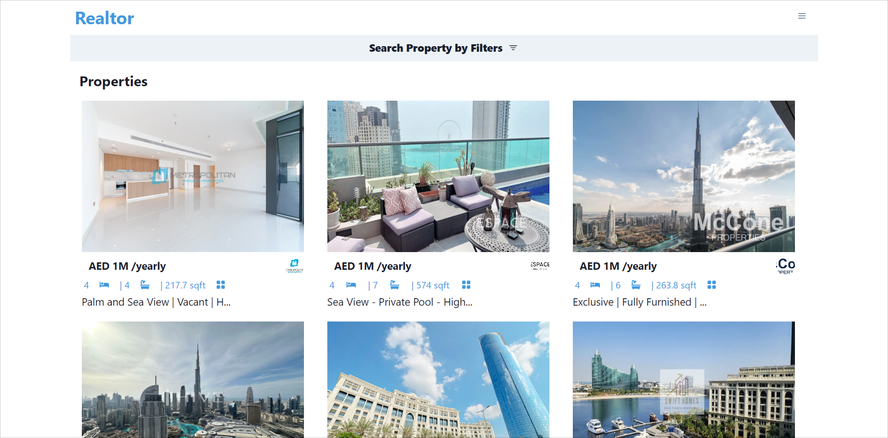
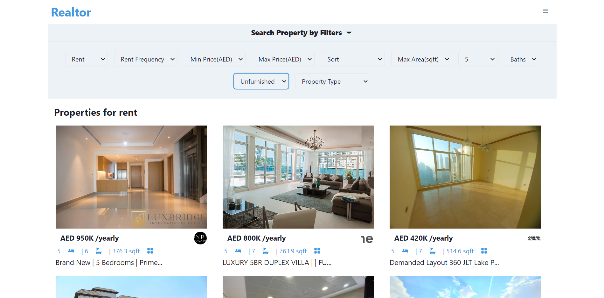
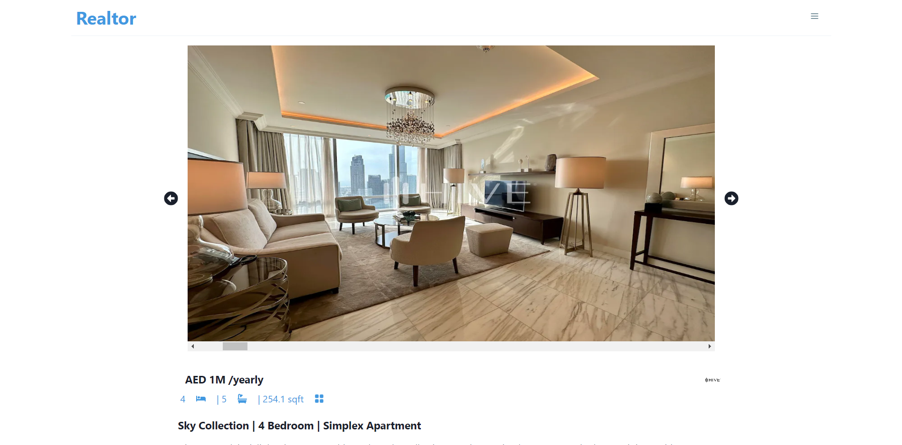
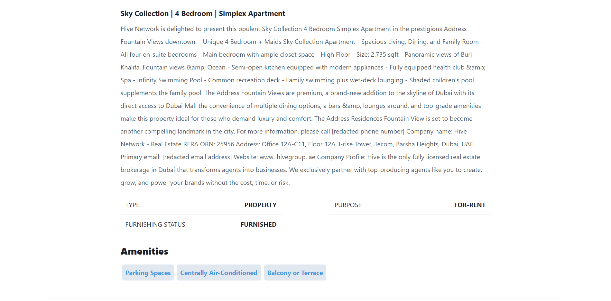

# Realtor

A modern real estate application to search for popular properties in the UAE.

## Technology stack

- NextJS
- Chakra-UI
- Axios

## Functionalities

- Search for a property (Buy/Rent)
- Filter properties by criteria (e.g. min price, max price, number of rooms, etc.)
- View property details

## APIs used

- [Bayut API](https://rapidapi.com/apidojo/api/bayut)

## Screenshots

